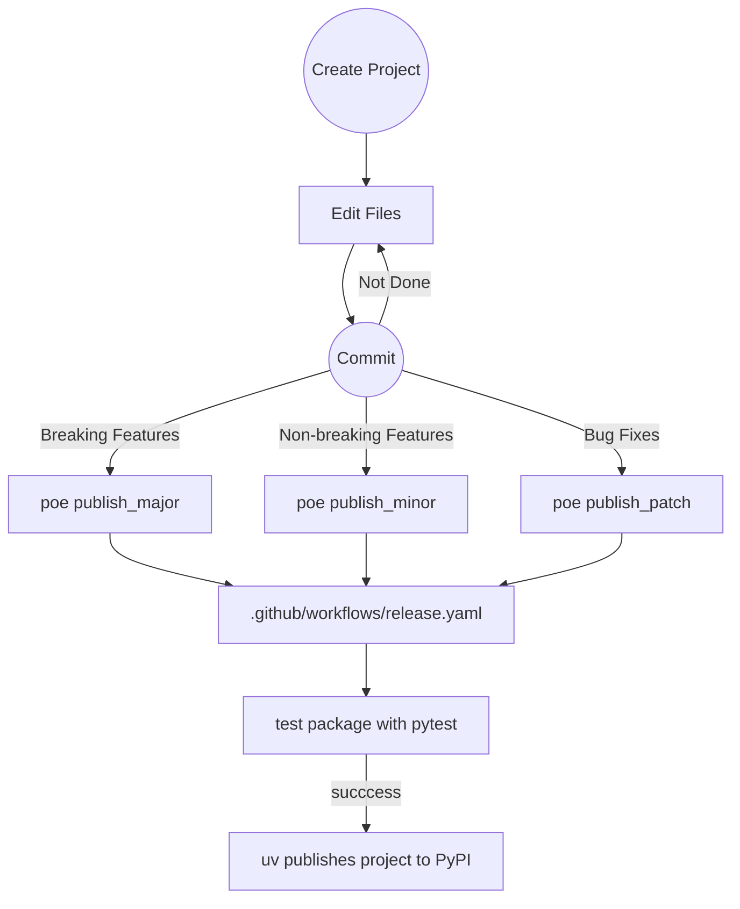

[![gh:JnyJny/python-package-cookiecutter][python-package-cookiecutter-badge]][python-package-cookiecutter] [release][release-badge]

# Python Package Cookiecutter Template

There are many [cookiecutter][cookiecutter] [templates][templates],
but this one is mine. With it, you can quickly create a full-featured
Python package designed to be managed with [uv][uv], a default
[typer][typer] command-line interface, optional settings using
[pydantic-settings][pydantic-settings] and logging using my favorite
logger, [loguru][loguru]. Best of all, testing, code quality checks,
and publishing to PyPI are all baked in and ready to go.

## Package Generation Features
- Auto detects user name and email from .gitconfig.
- Creates a virtual environment in the project directory.
- Enables direnv for this subdirectory if direnv available.
- Automatically syncs deps and project into virtual environment.
- Automatically initializes a git repository with a main branch.
- Automatically creates initial commit.
- Optionally creates upstream repository and pushes (GitHub only, requires [gh][gh]).

## Package Features
- Python project designed to be managed with [uv][uv].
- Exposes a command line interface built with [typer][typer].
- Settings optionally managed vi [pydantic-settings][pydantic-settings].
- Package is callable via `python -m <package>`.
- [Poe the Poet][poe] tasks integrated into pyproject.toml:
  - Test with pytest.
  - Generate HTML code coverage reports.
  - Run code quality checks using mypy, ruff, and ty.
  - Publish to PyPI via GitHub Actions with `poe publish`.
- Development tool options integrated into pyproject.toml.
- Optionally configured badges in README.md.

## Prerequisites

### User Accounts
- GitHub account _optional_ but recommended
- PyPI account _optional_ but recommended

### Required Tools
- [git][git]
- [uv][uv]
- [cookiecutter][cookiecutter] via uvx

### _Optional_ but Recommended Tools
- [direnv][direnv]
- [gh][gh]

## Initial Project Creation

Once you have uv installed, you get uvx for free!

If you haven't authenticated to GitHub with gh yet and you plan to
ask cookiecutter to create the upstream repository, you should do
that now:

```console
gh auth login
```

All done? Now you are ready to create your project:

```console
uvx cookiecutter gh:JnyJny/python-package-cookiecutter
```

After following the cookiecutter prompts, you should see the
following:

```console
...
Task [Create .venv        ]: succeeded.
Task [Enable Direnv       ]: succeeded.
Task [Sync Project Deps   ]: succeeded.
Task [Initialize Git      ]: succeeded.
Task [Add Files           ]: succeeded.
Task [Initial Commit      ]: succeeded.
Task [Create Upstream Repo]: succeeded.
Task [Push To Upstream    ]: succeeded.
$
```

If you didn't ask for the upstream repo, the last two tasks will not
be run. If you don't have gh installed or you aren't authenticated,
those last two tasks will fail but the template generation will
complete successfully.


### Example Generated Package Tree
```console
$ tree -a -I .venv -I .git
.
├── .envrc
├── .github
│   └── workflows
│       ├── README.md
│       └── release.yaml
├── .gitignore
├── LICENSE
├── pyproject.toml
├── README.md
├── src
│   └── thing
│       ├── __init__.py
│       └── __main__.py
├── tests
│   └── __init__.py
└── uv.lock
```

### Post Install

If you have [direnv][direnv] installed, your project's virtual
environment will be activated when you enter the project directory or
sub-directories. Without direnv, you can activate the project virtual
environment manually with `source .venv/bin/activate`, but it's less
cool.

Once your venv is activated, all the dev tools are available for use
without having to use `uv run` to preface the command. Check out `poe`!


#### Default Poe Tasks 

```console
$ poe
Poe the Poet - A task runner that works well with poetry.
version 0.34.0

Result: No task specified.

Usage:
  poe [global options] task [task arguments]

Global options:
  -h, --help [TASK]     Show this help page and exit, optionally supply a task.
  --version             Print the version and exit
  -v, --verbose         Increase command output (repeatable)
  -q, --quiet           Decrease command output (repeatable)
  -d, --dry-run         Print the task contents but don't actually run it
  -C, --directory PATH  Specify where to find the pyproject.toml
  -e, --executor EXECUTOR
                        Override the default task executor
  --ansi                Force enable ANSI output
  --no-ansi             Force disable ANSI output

Configured tasks:
  coverage              Generate HTML code coverage report and open it in a browser. [Code Quality]
  mypy                  Run mypy type checker on source. [Code Quality]
  ty                    Run ty type checker on source. [Code Quality]
  ruff                  Run ruff linter on source. [Code Quality]
  check                 Run all code quality tools on source.
  test                  Runs testing suites using pytest.
  publish_patch         Publish a patch release.
  publish_minor         Publish a minor release.
  publish_major         Publish a major release.
  publish               Publish a minor release.
  clean                 Clean up the project directory.
```

These are the tasks that I like. Feel free to hack them up however it
suits you best. It won't hurt my feelings at all.

## Example Development Workflow



1. Create project from template
1. Edit package to suit yourself.
1. Commit and push changes to your repo.
1. Publish a minor release using `poe publish`.

### Things You Will Want to Change

#### .github/workflows/release.yml

The `release.yaml` workflow defines a matrix of operating systems and
Python versions to test against. Tests are run when a [semantic
versioning][semantic-version] tag or a tag with the suffix "-test" is
pushed to a branch. If and when the requested tests complete
successfully, the package will be built and published to PyPI, unless
the triggering tag has a "-test" suffix in which case the workflow
skips publishing.

In it's initial state, tests are run against Linux, MacOS, and Windows
for Python versions 3.9, 3.10, 3.11, 3.12 and 3.13. This will result
in 15 seperate test instances that need to succeed before the publish
stage of release will start. Chances are very good you don't need that
sort of rigor in testing, so feel free to trim the os and
python-version lists to fit your needs.


## TODO
- Automatic [GitHub release][github-release] creation in release workflow.
- Automatic [release notes generator][release-drafter] in release workflow.
- Integration with [readthedocs.io][readthedocs].
- Add [GitHub templates][github-templates] to .github directory.


<!-- End Links -->
[python-package-cookiecutter-badge]: https://img.shields.io/badge/Made_With_Cookiecutter-python--package--cookiecutter-green?style=for-the-badge
[python-package-cookiecutter]: https://github.com/JnyJny/python-package-cookiecutter
[release-badge]: https://img.shields.io/github/v/release/JnyJny/python-package-cookiecutter?sort=semver&display_name=release&style=for-the-badge&color=green

[cookiecutter]: https://cookiecutter.readthedocs.io/en/stable/index.html
[templates]: https://www.cookiecutter.io/templates
[poe]: https://poethepoet.natn.io
[git]: https://git-scm.com/downloads
[uv]: https://docs.astral.sh/uv/
[direnv]: https://direnv.net
[gh]: https://github.com/cli/cli
[typer]: https://typer.tiangolo.com
[loguru]: https://loguru.readthedocs.io/en/stable/
[pydantic-settings]: https://docs.pydantic.dev/latest/api/pydantic_settings/
[semantic-version]: https://semver.org

<!-- TODO References -->
[readthedocs]: https://docs.readthedocs.com/platform/latest/tutorial/index.html
[release-drafter]: https://github.com/marketplace/actions/release-drafter
[github-release]: https://github.com/marketplace/actions/create-a-release-in-a-github-action
[github-templates]: https://docs.github.com/en/communities/using-templates-to-encourage-useful-issues-and-pull-requests/about-issue-and-pull-request-templates

