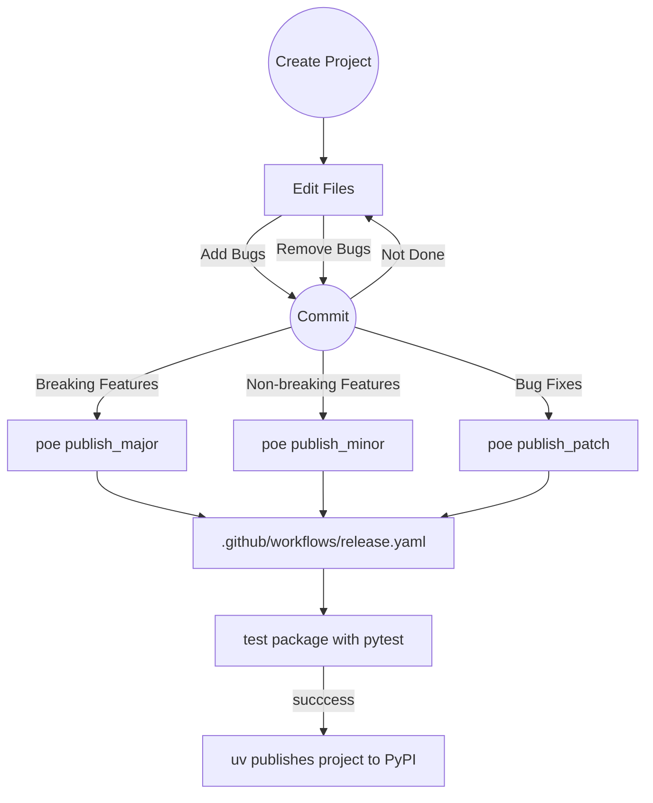

[![gh:JnyJny/python-package-cookiecutter][python-package-cookiecutter-badge]][python-package-cookiecutter] ![release][release-badge] [![test-status][test-status-badge]][testing-workflow]

# Python Package Cookiecutter Template

There are many [cookiecutter][cookiecutter] [templates][templates],
but this one is mine and I'm sharing it with you. With it, you can
quickly create a full-featured Python package designed to be managed
with [uv][uv] and [direnv][direnv], a default [typer][typer]
command-line interface, optional settings using
[pydantic-settings][pydantic-settings] and logging using my favorite
logger, [loguru][loguru]. Development activities like testing, code
quality checks, and publishing to PyPI are all baked in and ready to
go thanks to [Poe The Poet][poe]. Best of all, I've added all sorts of
templates and base files to help provide a great GitHub experience for
you and people that interact with your project repository.

## Build Features

- Choose from a [plethora][plethora] of Open Source licenses.
- Automatically detects GitHub user name and email address (if configured).
- Installs requested version of development Python if needed.
- Creates a virtual environment in the project directory.
- Enables `direnv` for this subdirectory if `direnv` available.
- Automatically syncs dependencies and the project into virtual environment.
- Automatically initializes a git repository with a main branch.
- Automatically creates an initial git commit.
- Optionally creates an upstream repository and pushes (GitHub only, requires [gh][gh]).

## Package Features

- Python project designed to be managed with [uv][uv].
- Exposes a command line interface built with [typer][typer].
- Package is callable via `python -m <package>`.
- [Poe the Poet][poe] tasks integrated into pyproject.toml:
  - Test with pytest.
  - Generate HTML code coverage reports.
  - Run code quality checks using `mypy`, `ruff`, and `ty`.
  - Publish to PyPI via GitHub Actions with `poe publish`.
- Development tool options integrated into pyproject.toml.
- Generic GitHub Issue and Pull Request templates.
- Configured to use [dependabot][dependabot] dependency checker.
  - Checks project dependencies.
  - Checks project GitHub action dependencies.
- Operating System and Python version test matrices.
- Configured to use [direnv][direnv] to automatically activate & deactivate venvs.
- Optionally configured badges in README.md for cool points.
- Optionally managed CLI settings using [pydantic-settings][pydantic-settings].
- Optionally logs to a file.

## Prerequisites

### User Accounts
- GitHub account _optional_ but recommended
- PyPI account _optional_ but recommended

### Tools You Need To Make This Work

| Tool | Required | Optional | Use |
|------|----------|----------|-----|
|[cookiecutter][cookiecutter]| ✅ | |Creates projects from templates.|
|[git][git]| ✅ | | Version control system. |
|[uv][uv]| ✅ | | Manage python, virtual environments and your project!|
|[direnv][direnv]| |✅ |Automatically activate and deactivate virtual environments.|
|[gh][gh]| | ✅ | GitHub CLI tool for working with repositories.|


## Creating Your Project


If you haven't authenticated to GitHub with `gh` yet and you plan to
ask `cookiecutter` to create the upstream repository, you should do
that now:

```console
gh auth login
```

All done? Now you are ready to create your project and the good news
is once you install `uv` you get the great tool runner `uvx` for free!

```console
uvx cookiecutter gh:JnyJny/python-package-cookiecutter
```

After answering the `cookiecutter` prompts, you should see the
following:

```console
Task [Install Dev Python............] 🟢
Task [Create .venv..................] 🟢
Task [Enable Direnv.................] 🟢
Task [Sync Project Deps.............] 🟢
Task [Ruff Check Source.............] 🟢
Task [Initialize Git................] 🟢
Task [Add Files.....................] 🟢
Task [Initial Commit................] 🟢
Task [Create Upstream Repo .........] 🟢
$ 
```

If you didn't ask to have the upstream GitHub repository created, the
last task will not run.  If you don't have `gh` installed or you
aren't authenticated, the last task will fail but the template
generation will complete successfully.

### Example Package Tree

```console
$ poe tree
.
├── .cookiecutter.json
├── .envrc
├── .github
│   ├── dependabot.yaml
│   ├── ISSUE_TEMPLATE
│   │   ├── 1_bug_report.yaml
│   │   ├── 2_feature_request.yaml
│   │   ├── 3_question.yaml
│   │   └── config.yaml
│   ├── PULL_REQUEST_TEMPLATE.md
│   └── workflows
│       ├── README.md
│       └── release.yaml
├── .gitignore
├── CONTRIBUTING.md
├── LICENSE
├── pyproject.toml
├── README.md
├── src
│   └── thing
│       ├── __init__.py
│       ├── __main__.py
│       ├── self_subcommand.py
│       └── settings.py
├── tests
│   ├── __init__.py
│   ├── conftest.py
│   └── test_cli.py
└── uv.lock
```

The `.cookiecutter.json` file is a dump of the cookiecutter JSON that
created this project.  The `.envrc` file can be safely removed if you
aren't using [direnv][direnv].

## Post Install

If you have [direnv][direnv] installed, your project's virtual
environment will be activated when you enter the project directory or
sub-directories. You can activate the project virtual environment
manually without `direnv` using `source .venv/bin/activate`, but it's
less cool.

Once your venv is activated, all the development tools are available
for use without having to use `uv run` to preface the command. Check
out `poe`!


## Default Poe Tasks 

```console
$ poe
Poe the Poet - A task runner that works well with poetry.
version 0.34.0

Result: No task specified.

Usage:
  poe [global options] task [task arguments]

Global options:
  -h, --help [TASK]     Show this help page and exit, optionally supply a task.
  --version             Print the version and exit
  -v, --verbose         Increase command output (repeatable)
  -q, --quiet           Decrease command output (repeatable)
  -d, --dry-run         Print the task contents but don't actually run it
  -C, --directory PATH  Specify where to find the pyproject.toml
  -e, --executor EXECUTOR
                        Override the default task executor
  --ansi                Force enable ANSI output
  --no-ansi             Force disable ANSI output

Configured tasks:
  coverage              [Code Quality] Open generated coverage report in a browser.
  mypy                  [Code Quality] Run mypy type checker on source.
  ty                    [Code Quality] Run ty type checker on source.
  ruff-check            [Code Quality] Run ruff check on source.
  ruff-format           [Code Quality] Run ruff format on source.
  ruff                  [Code Quality] Run Ruff check and format on source.
  check                 [Code Quality] Run all code quality tools on source.
  test                  [Code Quality] Runs testing suites using pytest.
  qc                    [Code Quality] Run all code quality tasks.
  publish_patch         [Publish] Patch release.
  publish_minor         [Publish] Minor release.
  publish_major         [Publish] Major release.
  publish               [Publish] Minor release.
  clean                 [Clean] Remove testing, build and code quality artifacts.
  tree                  [Misc] List project files in tree format.
```

These are the tasks that I like. Feel free to hack them up however it
suits you best. It won't hurt my feelings at all.

## Example Development Workflow

This is roughly how I write code and how I would use the generated package.



## Things You Will Want to Change

This package is how I like things and it would be an unimaginable
coincidence if this was exactly how you like things. I've listed some
files here that you will definitely want to consider changing to suit
your needs.

### LICENSE

Depending on the Open Source license you chose, you may need to edit
the license file and/or source files to be in compliance with the
license. I am not a lawyer. I don't play one on TV. I am the last
person to ask for advice on this matter. Also, I am not a lawyer.

### CONTRIBUTING.md

You want to update this file with all the details that potential
contributors to your project need to know. This file is currently a
skeleton. Be as specific as possible.

### pyproject.toml - Trove Classifiers

I supply a couple of [Trove classifiers][trove-classifiers] in the
project `pyproject.toml` file, however you should update them to
match the specific details of your project. It will help people
connect with your project.

### pyproject.toml - ruff rules

You may not want to check against _ALL_ of the rules. Or maybe you do.


### pyproject.toml - tool.poe.tasks.qc

The `qc` poe task runs all the of the code quality tasks which could
be called "a lot". Pare those down or add the checks that make sense
for your project.


### .github/ISSUE_TEMPLATE/*.yaml

This directory holds a set of YAML files describing GitHub [Issue
templates][github-templates]. You should edit them to reflect your
projects needs and personality. You may want to uncomment and edit
issue links in `config.yaml` if it suits your needs.

### .github/workflows/release.yml

The `release.yaml` workflow defines a matrix of operating systems and
Python versions to test against. Tests are run when a [semantic
versioning][semantic-version] tag or a tag with the suffix "-test" is
pushed to a branch. If and when the requested tests complete
successfully, the package will be built and published to PyPI, unless
the triggering tag has a "-test" suffix in which case the workflow
skips publishing.

Tests are designed to be run against matrices of Operating System and
Python version values. The matrices can be a list with a single item
or a list of multiple items.

## The End

If you've read this far, [you have my gratitude][gratitude]. Send me
some email, open an issue, or just make something cool (and let me know!).

<!-- End Links -->

<!-- badges -->
[python-package-cookiecutter-badge]: https://img.shields.io/badge/Made_With_Cookiecutter-python--package--cookiecutter-green?style=for-the-badge
[python-package-cookiecutter]: https://github.com/JnyJny/python-package-cookiecutter
[release-badge]: https://img.shields.io/github/v/release/JnyJny/python-package-cookiecutter?sort=semver&display_name=tag&style=for-the-badge&color=green
[test-status-badge]: https://img.shields.io/github/actions/workflow/status/JnyJny/python-package-cookiecutter/release.yaml?style=for-the-badge&label=Tests
[testing-workflow]: https://github.com/JnyJny/python-package-cookiecutter/actions/workflows/release.yaml

<!-- resources -->
[cookiecutter]: https://cookiecutter.readthedocs.io/en/stable/index.html
[templates]: https://www.cookiecutter.io/templates
[poe]: https://poethepoet.natn.io
[git]: https://git-scm.com/downloads
[uv]: https://docs.astral.sh/uv/
[direnv]: https://direnv.net
[gh]: https://github.com/cli/cli
[typer]: https://typer.tiangolo.com
[loguru]: https://loguru.readthedocs.io/en/stable/
[pydantic-settings]: https://docs.pydantic.dev/latest/api/pydantic_settings/
[semantic-version]: https://semver.org
[dependabot]: https://docs.github.com/en/code-security/dependabot
[trove-classifiers]: https://pypi.org/classifiers/
[readthedocs]: https://docs.readthedocs.com/platform/latest/tutorial/index.html
[release-drafter]: https://github.com/marketplace/actions/release-drafter
[github-release]: https://github.com/marketplace/actions/create-a-release-in-a-github-action
[github-templates]: https://docs.github.com/en/communities/using-templates-to-encourage-useful-issues-and-pull-requests/about-issue-and-pull-request-templates

<!-- silly -->
[plethora]: https://youtu.be/P8ROhP_3-Qk?si=Qlt6RAERwT1VbEbw&t=24
[gratitude]: https://youtu.be/xl55ltDG5Ow?si=Q2XQqif1xo1OGqPn
