[![gh:JnyJny/python-package-cookiecutter][python-package-cookiecutter-badge]][python-package-cookiecutter] [![releases][release-badge]][releases] [![test-status][test-status-badge]][testing-workflow]

# Python Package Cookiecutter Template

There are many [cookiecutter][cookiecutter] [templates][templates],
but this one is mine and I'm sharing it with you. With it, you can
quickly create a full-featured Python package designed to be managed
with [uv][uv] and [direnv][direnv], a default [typer][typer]
command-line interface, optional settings using
[pydantic-settings][pydantic-settings] and logging using my favorite
logger, [loguru][loguru]. Development activities like testing, code
quality checks, and publishing to PyPI are all baked in and ready to
go thanks to [Poe The Poet][poe]. Project documentation is
automatically configured to deploy to GitHub Pages using
[MkDocs][mkdocs]. Best of all, I've added all sorts of templates and
base files to help provide a great GitHub experience for you and
people that interact with your project repository.

## TL;DR - Create Your New Project

### With uvx 

```console
uvx cookiecutter gh:JnyJny/python-package-cookiecutter
```

### With pip
```console
pip install cookiecutter
cookiecutter gh:JnyJny/python-package-cookiecutter
```

### Get To Work!
```
cd your-new-project
poe --help
```

## Build Features

- Choose from a [plethora][plethora] of Open Source licenses.
- Automatically detects GitHub user name and email address (if configured).
- Installs requested version of development Python if needed.
- Creates a virtual environment in the project directory.
- Enables `direnv` for this subdirectory if `direnv` available.
- Automatically syncs dependencies and the project into virtual environment.
- Automatically initializes a git repository with a main branch.
- Automatically creates an initial git commit.
- Optionally creates an upstream repository and pushes (GitHub only, requires [gh][gh]).
- Automatically enables GitHub Pages for MkDocs documentation deployment.

## So Many Package Features

### Code Features
- Python `src` style project designed to be managed with [uv][uv].
- Includes a command line interface built with [typer][typer].
  - Application settings optionally managed with [pydantic-settings][pydantic-settings].
  - Preconfigured with a `self` subcommand like all the cool kids.
- Logging handled by [loguru][loguru] with optional logging to a file.
- Package is also callable via `python -m <package>` magic.
- Package documentation built with [MkDocs][mkdocs].
- Automatic API documentation generation from docstrings.


### Quality Of Life Features
- [Poe the Poet][poe] tasks integrated into pyproject.toml:
  - Test with pytest, tests started for you!
  - Generate HTML code coverage reports.
  - Run code quality checks using `ruff` and `ty`.
  - Publish to PyPI via GitHub Actions with `poe publish`.
  - Serve, build, and deploy documentation with `poe docs-*` tasks.
- Development tool options integrated into pyproject.toml.

### GitHub Integrations
- Generic GitHub Issue and Pull Request templates.
- The [dependabot][dependabot] checks:
  - project dependencies daily.
  - project GitHub action dependencies weekly.
- Operating System and Python version test matrices.
- Automated documentation deployment to GitHub Pages via GitHub Actions.
- Themed MkDocs workflow with search and API documentation.
- Automatic GitHub release generation with release notes.

#### GitHub Actions Workflow

The template includes a comprehensive CI/CD pipeline triggered by semantic version tags:

```mermaid
flowchart TD
    Tag[Tag v1.2.3 pushed] --> Extract[Get Python Versions<br/>from pyproject.toml]
    Extract --> Test[Test Matrix<br/>OS × Python versions]
    
    Test --> |All tests pass| Build[Build Package<br/>uv build]
    Test --> |Tests fail| Fail[❌ Workflow fails]
    
    Build --> Upload[Upload Artifacts<br/>dist/]
    
    Upload --> Publish[Publish to PyPI<br/>Trusted Publishing]
    Upload --> Release[Create GitHub Release<br/>Auto-generated notes]
    
    Publish --> |Success| DocsTrigger[Trigger Docs Deployment]
    Release --> |Success| DocsTrigger
    
    DocsTrigger --> DocsDispatch[Repository Dispatch<br/>release-complete]
    DocsDispatch --> EnablePages[Enable GitHub Pages<br/>if needed]
    EnablePages --> DocsBuild[Build MkDocs<br/>Documentation]
    DocsBuild --> DocsDeploy[Deploy to<br/>GitHub Pages]
    
    style Tag fill:#e1f5fe
    style Test fill:#fff3e0
    style Build fill:#f3e5f5
    style Publish fill:#e8f5e8
    style Release fill:#e8f5e8
    style DocsDeploy fill:#fff8e1
    style Fail fill:#ffebee
```



**Workflow Features:**
- **Dynamic Python Testing**: Automatically detects Python versions from `pyproject.toml`
- **Matrix Testing**: Tests across multiple OS and Python combinations
- **Trusted Publishing**: Secure PyPI publishing without API tokens
- **Artifact Management**: Efficient sharing of build artifacts between jobs
- **Auto-generated Releases**: Intelligent changelog and release notes generation
- **Documentation Deployment**: Automatic MkDocs deployment to GitHub Pages
- **Conditional Execution**: Only releases on proper semantic version tags


### Miscellaneous
- Configured to use [direnv][direnv] to automatically activate & deactivate venvs.
- Optionally configured badges in README.md for cool points.


## Prerequisites

### User Accounts
- GitHub account _optional_ but recommended.
- PyPI account _optional_ but recommended.

### Tools You Need To Make This Work

| Tool | Required | Optional | Use |
|------|----------|----------|-----|
|[cookiecutter][cookiecutter]| ✅ | |Creates projects from templates.|
|[git][git]| ✅ | | Version control system. |
|[uv][uv]| ✅ | | Manage python, virtual environments and your project!|
|[direnv][direnv]| |✅ |Automatically activate and deactivate virtual environments.|
|[gh][gh]| | ✅ | GitHub CLI tool for working with repositories.|


## Creating Your Project

If you haven't authenticated to GitHub with `gh` yet and you plan to
ask `cookiecutter` to create the upstream repository, you should do
that now:

```console
gh auth login
```

All done? Now you are ready to create your project and the good news
is once you install `uv` you get the great tool runner `uvx` for free!

```console
uvx cookiecutter gh:JnyJny/python-package-cookiecutter
```

After answering the `cookiecutter` prompts, you should see the
following:

```console
✨ Your new project <PACKAGE_NAME> is ready to use! ✨
$ 
```

### Example Package Tree

```console
$ cd <YOUR_PACKAGE_NAME_HERE>
$ poe tree

├── .cookiecutter.json
├── .envrc
├── .github
│   ├── dependabot.yaml
│   ├── ISSUE_TEMPLATE
│   │   ├── 1_bug_report.yaml
│   │   ├── 2_feature_request.yaml
│   │   ├── 3_question.yaml
│   │   └── config.yaml
│   ├── PULL_REQUEST_TEMPLATE.md
│   └── workflows
│       ├── docs.yml
│       ├── README.md
│       └── release.yaml
├── .gitignore
├── CONTRIBUTING.md
├── docs
│   ├── changelog.md
│   ├── contributing.md
│   ├── gen_ref_pages.py
│   ├── getting-started
│   │   ├── configuration.md
│   │   ├── installation.md
│   │   └── quickstart.md
│   ├── index.md
│   └── user-guide
│       ├── cli.md
│       └── examples.md
├── LICENSE
├── mkdocs.yml
├── pyproject.toml
├── README.md
├── src
│   └── <YOUR_PACKAGE_NAME_HERE>
│       ├── __init__.py
│       ├── __main__.py
│       ├── self_subcommand.py
│       └── settings.py
├── tests
│   ├── __init__.py
│   ├── conftest.py
│   └── test_cli.py
└── uv.lock
```

The `.cookiecutter.json` file is a dump of the cookiecutter JSON that
created this project.  The `.envrc` file can be safely removed if you
aren't using [direnv][direnv].

## Post Install

If you have [direnv][direnv] installed, your project's virtual
environment will be activated when you enter the project directory or
sub-directories. You can activate the project virtual environment
manually without `direnv` using `source .venv/bin/activate`, but it's
less cool. If you liked `poetry shell` this feature will appeal to
you.

Once your venv is activated, all the development tools are available
for use without having to use `uv run` to preface the command. Check
out `poe`!


## Default Poe Tasks 

```console
$ poe
Poe the Poet - A task runner that works well with poetry.
version 0.34.0

Result: No task specified.

Usage:
  poe [global options] task [task arguments]

Global options:
  -h, --help [TASK]     Show this help page and exit, optionally supply a task.
  --version             Print the version and exit
  -v, --verbose         Increase command output (repeatable)
  -q, --quiet           Decrease command output (repeatable)
  -d, --dry-run         Print the task contents but don't actually run it
  -C, --directory PATH  Specify where to find the pyproject.toml
  -e, --executor EXECUTOR
                        Override the default task executor
  --ansi                Force enable ANSI output
  --no-ansi             Force disable ANSI output

Configured tasks:
  coverage              [Code Quality] Open generated coverage report in a browser.
  ty                    [Code Quality] Run ty type checker on source.
  ruff-check            [Code Quality] Run ruff check on source.
  ruff-format           [Code Quality] Run ruff format on source.
  ruff                  [Code Quality] Run Ruff check and format on source.
  check                 [Code Quality] Run all code quality tools on source.
  test                  [Code Quality] Runs testing suites using pytest.
  qc                    [Code Quality] Run all code quality tasks.
  publish_patch         [Publish] Patch release.
  publish_minor         [Publish] Minor release.
  publish_major         [Publish] Major release.
  publish               [Publish] Minor release.
  clean                 [Clean] Remove testing, build and code quality artifacts.
  tree                  [Misc] List project files in tree format.
  docs-serve            [Documentation] Serve documentation locally for development.
  docs-build            [Documentation] Build documentation for production.
  docs-deploy           [Documentation] Deploy documentation to GitHub Pages.
```

These are the tasks that I like. Feel free to hack them up however it
suits you best. It won't hurt my feelings at all.

## Documentation with MkDocs

Generated projects include a complete documentation setup using
[MkDocs][mkdocs] with your choice of themes:

### Theme Options
Choose from five MkDocs themes during project generation:

- **Material** - Modern Material Design with dark/light mode, advanced navigation.
- **Read the Docs** - Classic documentation style, clean and familiar.
- **MkDocs** - Default lightweight theme, simple and fast.
- **Bootstrap** - Responsive Bootstrap-based theme, mobile-friendly.
- **Windmill** - Clean minimal theme, distraction-free reading.

### Features
- **Auto-generated API documentation** from your code's docstrings.
- **Search functionality** with highlighting.
- **Automated deployment** to GitHub Pages via GitHub Actions.
- **Professional structure** with getting started, user guide, and API reference.
- **Theme-optimized configuration** with appropriate plugins and extensions.

### Automatic Deployment
When you push to the main branch, GitHub Actions automatically:
1. Builds your MkDocs documentation.
2. Deploys it to GitHub Pages at `https://username.github.io/project-name/`.

### Documentation Structure
```
docs/
├── index.md                   # Main documentation homepage
├── getting-started/
│   ├── installation.md        # Installation instructions
│   ├── quickstart.md          # Quick start guide
│   └── configuration.md       # Configuration options
├── user-guide/
│   ├── cli.md                 # CLI usage guide
│   └── examples.md            # Usage examples
├── contributing.md            # Contribution guidelines
├── changelog.md               # Project changelog
└── gen_ref_pages.py           # Auto-generates API reference
```

The documentation is automatically customized with your project name,
GitHub username, and other template values.

## Example Development Workflow

This is roughly how I write code and how I would use the generated package.

```mermaid
flowchart TD
    Create[Create Project<br/>cookiecutter template] --> Setup[Initial Setup<br/>uv sync, git init]
    Setup --> Edit[Edit Code<br/>Add features, fix bugs]
    
    Edit --> QC[Quality Control<br/>poe qc]
    QC --> |Issues found| Fix[Fix Issues]
    Fix --> QC
    QC --> |All checks pass| Commit[Git Commit<br/>Local changes]
    
    Commit --> Ready{Ready for<br/>Release?}
    Ready --> |No| Edit
    Ready --> |Yes| Version{Release Type?}
    
    Version --> |Bug Fixes| Patch[poe publish_patch<br/>v1.0.1]
    Version --> |New Features| Minor[poe publish_minor<br/>v1.1.0] 
    Version --> |Breaking Changes| Major[poe publish_major<br/>v2.0.0]
    
    Patch --> Tag[Create Git Tag<br/>Push to GitHub]
    Minor --> Tag
    Major --> Tag
    
    Tag --> CI[GitHub Actions<br/>CI/CD Pipeline]
    CI --> Success[✅ Published to PyPI<br/>📚 Docs Deployed<br/>🎉 GitHub Release]
    
    Success --> Edit
    
    style Create fill:#e1f5fe
    style QC fill:#fff3e0
    style Fix fill:#ffebee
    style Commit fill:#f3e5f5
    style Tag fill:#e8f5e8
    style Success fill:#e8f5e8
```



**Workflow Features:**
- **Quality First**: Built-in quality control with `poe qc` runs all checks
- **Semantic Versioning**: Clear patch/minor/major release workflow
- **Automated Publishing**: Push tags trigger complete CI/CD pipeline
- **Integrated Testing**: Quality checks before every commit
- **Documentation**: Auto-generated docs with every release

## Things You Will Want to Change

This package is how I like things and it would be an unimaginable
coincidence if this was exactly how you like things. I've listed some
files here that you will definitely want to consider changing to suit
your needs.

### LICENSE

Depending on the Open Source license you chose, you may need to edit
the license file and/or source files to be in compliance with the
license. I am not a lawyer. I don't play one on TV. I am the last
person to ask for advice on this matter. Also, I am not a lawyer.

### CONTRIBUTING.md

You want to update this file with all the details that potential
contributors to your project need to know. This file is currently a
skeleton. Be as specific as possible.

### pyproject.toml - Trove Classifiers

I supply a couple of [Trove classifiers][trove-classifiers] in the
project `pyproject.toml` file, however you should update them to
match the specific details of your project. It will help people
connect with your project.

### pyproject.toml - ruff rules

You may not want to check against _ALL_ of the rules. Or maybe you do.


### pyproject.toml - tool.poe.tasks.qc

The `qc` poe task runs all the of the code quality tasks which could
be called "a lot". Pare those down or add the checks that make sense
for your project.


### .github/ISSUE_TEMPLATE/*.yaml

This directory holds a set of YAML files describing GitHub [Issue
templates][github-templates]. You should edit them to reflect your
projects needs and personality. You may want to uncomment and edit
issue links in `config.yaml` if it suits your needs.

### .github/workflows/release.yaml

The `release.yaml` workflow runs pytest to validate core functionality
when a [semantic versioning][semantic-version] tag is pushed. If tests
pass successfully, it automatically creates a PyPi release and a
GitHub release.

Tests are designed to be run against matrices of Operating System and
Python version values. The matrices can be a list with a single item
or a list of multiple items.

### .github/workflows/docs.yaml

The `docs.yaml` workflow will deploy your documentation to
https://username.github.io/package-name when a new tag is pushed to
the main branch. Depending on your needs, you may want to deploy the
documentation somewhere else.


## The End

If you've read this far, [you have my gratitude][gratitude]. Send me
some email, open an issue, or just make something cool (and let me know!).

<!-- End Links -->

<!-- badges -->
[python-package-cookiecutter-badge]: https://img.shields.io/badge/Made_With_Cookiecutter-python--package--cookiecutter-green?style=for-the-badge
[python-package-cookiecutter]: https://github.com/JnyJny/python-package-cookiecutter
[release-badge]: https://img.shields.io/github/v/release/JnyJny/python-package-cookiecutter?sort=semver&display_name=tag&style=for-the-badge&color=green
[releases]: https://github.com/JnyJny/python-package-cookiecutter/releases
[test-status-badge]: https://img.shields.io/github/actions/workflow/status/JnyJny/python-package-cookiecutter/release.yaml?style=for-the-badge&label=Tests
[testing-workflow]: https://github.com/JnyJny/python-package-cookiecutter/actions/workflows/release.yaml

<!-- resources -->
[cookiecutter]: https://cookiecutter.readthedocs.io/en/stable/index.html
[templates]: https://www.cookiecutter.io/templates
[poe]: https://poethepoet.natn.io
[git]: https://git-scm.com/downloads
[uv]: https://docs.astral.sh/uv/
[direnv]: https://direnv.net
[gh]: https://github.com/cli/cli
[typer]: https://typer.tiangolo.com
[loguru]: https://loguru.readthedocs.io/en/stable/
[pydantic-settings]: https://docs.pydantic.dev/latest/api/pydantic_settings/
[mkdocs]: https://www.mkdocs.org/
[mkdocs-material]: https://squidfunk.github.io/mkdocs-material/
[semantic-version]: https://semver.org
[dependabot]: https://docs.github.com/en/code-security/dependabot
[trove-classifiers]: https://pypi.org/classifiers/
[readthedocs]: https://docs.readthedocs.com/platform/latest/tutorial/index.html
[release-drafter]: https://github.com/marketplace/actions/release-drafter
[github-release]: https://github.com/marketplace/actions/create-a-release-in-a-github-action
[github-templates]: https://docs.github.com/en/communities/using-templates-to-encourage-useful-issues-and-pull-requests/about-issue-and-pull-request-templates

<!-- silly -->
[plethora]: https://youtu.be/P8ROhP_3-Qk?si=Qlt6RAERwT1VbEbw&t=24
[gratitude]: https://youtu.be/xl55ltDG5Ow?si=Q2XQqif1xo1OGqPn
